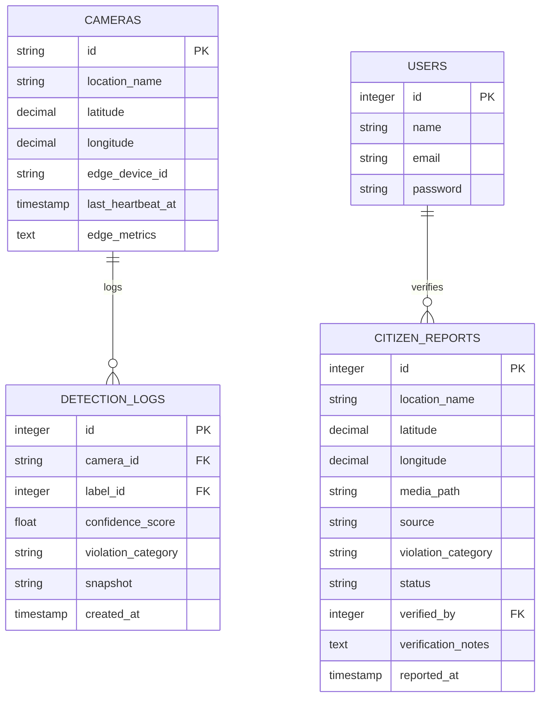

# PESAT - Smart City Monitoring System

**PESAT** (Sistem Informasi Peudong Syariat Lhokseumawe) adalah platform *Command Center* pemantauan kota pintar berbasis web *High-Fidelity* untuk kompetisi **GEMASTIK 2026**. Platform ini dirancang untuk mendeteksi pelanggaran ketertiban dan ketertiban umum/syariat secara otomatis menggunakan teknologi *Edge AI Computer Vision*, lalu menyajikannya secara *real-time* ke dasbor operator pusat kota.

---

## Panduan Instalasi Cepat & Cara Menjalankan

PESAT dibagi menjadi dua komponen utama: **Server Laravel (VPS/Pusat)** dan **Edge Device Pipeline (Python/Kamera)**.

### A. Konfigurasi Edge Device (Python Pipeline)

Edge Device memproses video CCTV secara lokal menggunakan model YOLO, lalu mengirim telemetri ke server pusat.

#### 1. Setup Otomatis (Satu-Klik)
Masuk ke direktori `mlcv` di terminal/command prompt:
* **Windows**:
  ```bash
  cd mlcv
  start.bat
  ```
* **Linux / macOS**:
  ```bash
  cd mlcv
  chmod +x start.sh
  ./start.sh
  ```
> **Catatan**: Skrip start-installer di atas akan secara otomatis mendeteksi Python, membuat Virtual Environment (`.venv`), menginstal seluruh dependensi dari `requirements.txt`, memvalidasi konfigurasi, dan menjalankan program orkestrasi kamera.

#### 2. Konfigurasi File (`mlcv/edge_config.yaml`)
Sesuaikan parameter koneksi ke server pusat:
```yaml
api_base: "http://localhost:8000"           # Domain/IP Server Laravel
api_key: "83VOcMbYvPrzdsWCDJmKEUphAZ2BqHxT" # Harus sama dengan PESAT_API_KEY di .env Laravel
inference_interval_seconds: 5               # Jeda waktu analisis per frame
min_confidence: 0.75                        # Threshold minimum deteksi pelanggaran
heartbeat_interval_seconds: 30              # Detak jantung telemetri edge ke server
```

---

### B. Konfigurasi Server Utama (Laravel Backend & Dashboard)

#### 1. Setup Database & Instalasi Dependensi
Jalankan perintah berikut di direktori `laravel`:
```bash
composer install
npm install
```

#### 2. Konfigurasi Lingkungan (`.env`)
Salin file `.env.example` menjadi `.env` dan sesuaikan parameter berikut:
```env
APP_NAME=PESAT
APP_ENV=local
APP_DEBUG=true
APP_URL=http://localhost:8000

# Kunci Otentikasi API Edge Device (Wajib sama dengan edge_config.yaml)
PESAT_API_KEY=83VOcMbYvPrzdsWCDJmKEUphAZ2BqHxT

# Pilihan Real-time Driver (Default 'log' untuk mode hemat RAM VPS 1GB)
BROADCAST_CONNECTION=log
QUEUE_CONNECTION=sync
CACHE_STORE=file
```

#### 3. Migrasi & Pengisian Awal Database
Jalankan migrasi tabel database dan masukkan data awal (seeding) untuk kamera dan akun administrator:
```bash
php artisan migrate --seed
```
* Akun Login default Admin/Petugas: **`petugas@pesat.id`** / password: **`password`**.

#### 4. Menjalankan Server & Aset Compiler
Jalankan server pengembangan Laravel dan bundler aset Vite:
* Jalankan server PHP:
  ```bash
  php artisan serve
  ```
* Jalankan compiler frontend:
  ```bash
  npm run dev
  ```
* Akses aplikasi melalui browser di: **`http://localhost:8000`**

---

## Stack Teknologi

PESAT dibangun menggunakan perpaduan teknologi tangguh untuk memastikan stabilitas dan performa maksimum pada infrastruktur hemat biaya:

| Lapisan | Teknologi | Deskripsi |
| :--- | :--- | :--- |
| **Backend Framework** | Laravel 13 & PHP 8.3 | Manajemen API gateway, otentikasi, validasi, dan log kueri. |
| **Frontend UI** | Vue 3 (Composition API) | Antarmuka dashboard responsif dengan Inertia.js. |
| **Admin Panel** | Filament v5 | Dasbor administrasi perangkat kamera, log, dan pengguna. |
| **Interactive Widgets** | Livewire v4 | Menggerakkan komponen widget dinamis dan terisolasi secara real-time (Island Architecture). |
| **Styling** | Vanilla CSS + Tailwind v4 | Tampilan premium modern (Light & Dark Mode) standar korporat. |
| **Real-time Map** | Leaflet.js | Pemetaan koordinat anomali kota secara interaktif. |
| **Edge AI Pipeline** | Python 3.13 & OpenCV | Akuisisi feed kamera CCTV dan prapemrosesan frame. |
| **AI Inference** | ONNX Runtime | Eksekusi model YOLOv8 (Pose & Klasifikasi Int8) secara optimal pada CPU/GPU lokal. |

---

## Skema Database & Relasi Tabel

Arsitektur data PESAT dirancang dengan normalisasi 3NF dan indeks terarah untuk menangani lalu lintas telemetri yang intensif.



### Kolom Kunci Kustom:
1. **`detection_logs.snapshot`**: Menyimpan berkas gambar unik per deteksi (`{camera_id}_{timestamp}.jpg`) untuk bukti visual anomali.
2. **`cameras.edge_metrics`**: Menyimpan telemetri perangkat keras tepi (beban CPU & RAM perangkat kamera) dalam format JSON secara dinamis.
3. **`citizen_reports.source`**: Memberi label asal laporan (`Masyarakat` atau `Deteksi AI`).
4. **`citizen_reports.violation_category`**: Kategori pelanggaran syariat terpadu (seperti *Khalwat*, *Pakaian Tidak Syar'i*, *Celana Pendek*, *Pergaulan Bebas*).

---

## Cakupan Fitur Utama (MVP Scope)

1. **Dashboard Command Center Spasial**:
   * Peta Interaktif Leaflet.js yang secara otomatis berkedip merah ketika terdeteksi anomali kritis.
   * Log aktivitas anomali real-time dengan sistem **peringatan audio** instan jika skor akurasi (confidence score) melebihi `0.85`.
2. **Dashboard Monitoring Perangkat Edge**:
   * Halaman pemantauan spesifikasi perangkat keras (CPU, RAM, dan status *online/offline* berdasarkan selisih *heartbeat* 5 menit) di panel Filament Admin.
3. **Sistem Laporan Masyarakat (Citizen Reports)**:
   * Fitur laporan anomali terintegrasi bagi publik dengan pengaman batas waktu (*cooldown*) 180 detik per perangkat untuk mencegah spamming.
4. **Widget Spesifikasi Komputasi Server Host**:
   * Widget eksklusif di dashboard admin Filament untuk menampilkan spesifikasi nyata (RAM, CPU Cores/Threads, Disk Space, OS Edisi Riil, Web Server, dan versi framework) secara langsung dan aman.

---

## Rahasia Optimasi VPS RAM 1GB (Production-Ready)

Aplikasi PESAT disiapkan untuk dapat berjalan tanpa hambatan pada spesifikasi VPS termurah (1 Core CPU / 1GB RAM / SSD Swap 2GB) di bawah panel aaPanel/OpenLiteSpeed:

1. **Incremental Polling 5 Detik Terisolasi**:
   Alih-alih menggunakan layanan WebSocket *persistent* (Laravel Reverb) yang memakan memory 200MB - 300MB RAM konstan di background, PESAT menggunakan polling 5 detik dengan dekorator **`#[Isolate]`** pada Livewire. Data statis di-cache selama 1 jam, sedangkan data dinamis di-cache 5 detik. Ini menjaga beban memori VPS tetap di bawah 80MB.
2. **Akselerasi X-Sendfile / X-LiteSpeed-Location**:
   Untuk menampilkan gambar snapshot pelanggaran berukuran besar (~300KB), Laravel tidak membaca gambar ke memori PHP. Laravel langsung menyerahkan tugas I/O tersebut ke server OpenLiteSpeed via header `X-LiteSpeed-Location`. Ini menghindarkan PHP-FPM dari kebocoran memori (*memory limit exhausted*).
3. **Toleransi Kegagalan WebSocket (Fault-Tolerance)**:
   Semua controller API telemetri dibungkus dengan blok `try-catch` sehingga jika Reverb diaktifkan di masa mendatang namun server WebSocket sedang mati, **koneksi skrip Python di lapangan tetap berjalan lancar 100% tanpa crash**.
4. **Tuning MariaDB**:
   Penyetelan `innodb_flush_log_at_trx_commit=2` dan `innodb_buffer_pool_size=128M` pada konfigurasi database aaPanel meningkatkan kecepatan penyimpanan log deteksi hingga **5 kali lipat** tanpa membebani memori VPS.
5. **OpCache Preloading**:
   Prapemuatan kernel Laravel menggunakan berkas `preload.php` pada konfigurasi `opcache.preload` PHP 8.3 memangkas waktu inisialisasi framework pada setiap request menjadi kurang dari **10ms**.